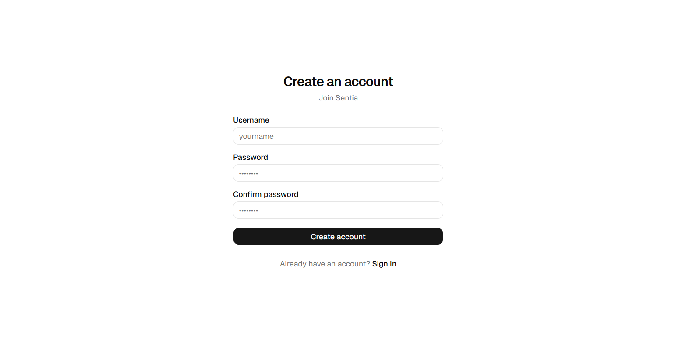
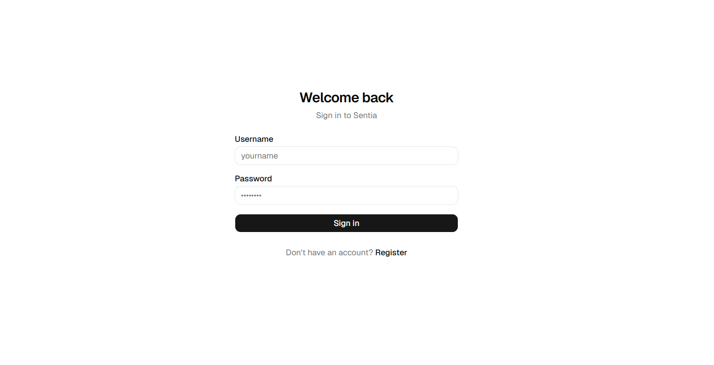
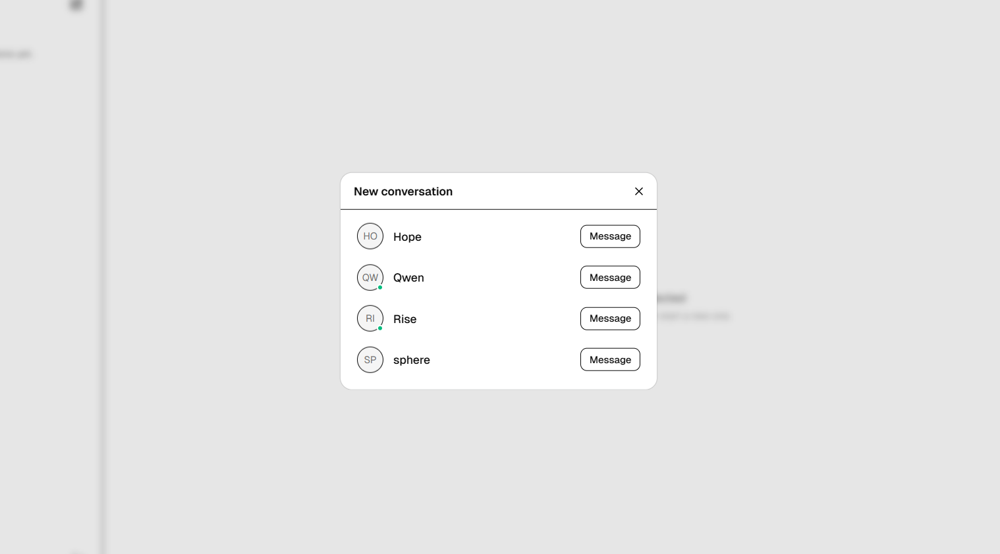
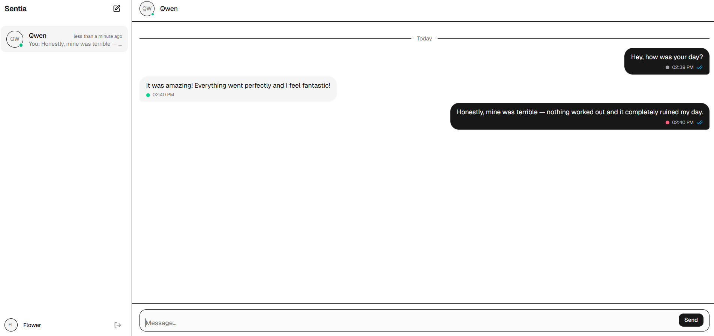
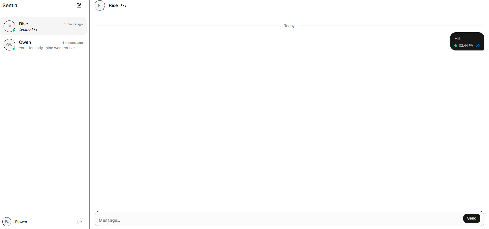
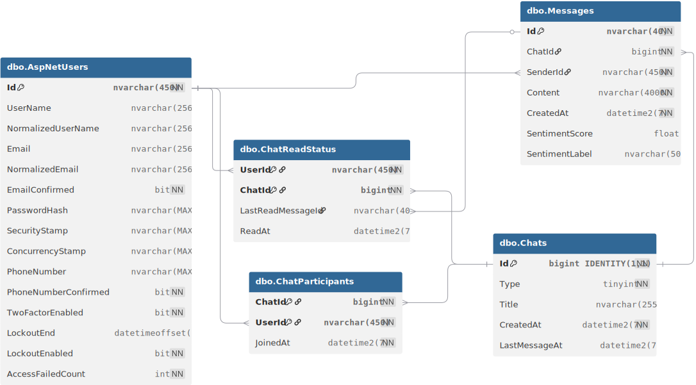

# Sentia 💬
A real-time chat application featuring live AI sentiment analysis. Sentia demonstrates modern full-stack development utilizing Clean Architecture, CQRS, and Azure cloud services.

### ⚙️ Backend

### 🎨 Frontend

### ☁️ Cloud & DevOps

---

## 🚀 Live Demo
**[🚀 View the Live Application](https://salmon-flower-083c06f03.7.azurestaticapps.net/)** 
Experience the real-time messaging and live AI sentiment analysis firsthand by exploring the deployed application. Create an account to start a conversation and watch the AI evaluate message sentiment on the fly.

---

## ✨ Key Capabilities

💬 **Real-Time Messaging:** Lightning-fast, bi-directional communication powered by Azure SignalR.  
🧠 AI Sentiment Analysis: Real-time processing of message tone (Positive 🟢, Neutral ⚪, Negative 🔴) using Azure Cognitive Services. This is handled via a non-blocking background System.Threading.Channel to keep the chat instantly responsive.
🟢 **Presence Tracking:** Live online status indicators for users.  
✍️ **Typing Indicators:** Real-time animated "user is typing..." feedback.  
🛡️ **Security & Rate Limiting:** JWT-based authentication, Azure Key Vault secret management, and endpoint rate-limiting.  
🚀 **Optimized Data Fetching:** Write operations are handled by Entity Framework Core, while complex read queries are optimized using **Dapper**.  

---

## 📸 Screenshots

---

## 🏗️ Architecture & Patterns

The project follows a strict layered architecture to ensure separation of concerns, testability, and scalability:

- **`Sentia.Domain`** – The enterprise core. Contains fundamental business entities (`Chat`, `Message`, `ChatParticipant`), enums, and domain events. It has absolutely zero external project dependencies.
- **`Sentia.Application`** – The use-case orchestrator. Houses all business logic using CQRS via MediatR (e.g., `SendMessageCommand`, `GetUserChatsQuery`). It includes DTOs, FluentValidation rules, and custom MediatR pipeline behaviors for Cross-Cutting Concerns (Validation and Authorization).
- **`Sentia.Infrastructure.Persistence`** – The data layer. Manages SQL Server access containing the EF Core `ApplicationDbContext`, Fluent API entity configurations, migrations, and highly optimized read-only data access using Dapper (`ChatQueryService`).
- **`Sentia.Infrastructure.Cognitive`** – The AI layer. Isolated integration with Azure Cognitive Services for Text Analytics. It implements a thread-safe `System.Threading.Channels` queue to offload sentiment processing from the main web threads.
- **`Sentia.Infrastructure.RealTime`** – The WebSocket layer. Encapsulates the Azure SignalR `ChatHub`, mapping user connections to SignalR groups, and manages live user states via the `PresenceTracker`.
- **`Sentia.API`** – The presentation/entry point. Exposes RESTful Controllers, configures Dependency Injection, handles JWT Bearer Authentication, enforces API Rate Limiting, maps global exceptions to `ProblemDetails`, and hosts the `SentimentBackgroundWorker`.

### Core Patterns
- **CQRS Pattern:** Implemented via **MediatR**. Commands and Queries are strictly segregated.
- **Pipeline Behaviors:** MediatR pipeline behaviors automatically handle cross-cutting concerns like **FluentValidation** and custom Chat Participant Authorization.
- **Background Processing:** AI Sentiment Analysis is offloaded to a background worker using `System.Threading.Channels` to ensure the main chat thread remains instantly responsive.
- **Global Error Handling:** Centralized exception handling returning standard RFC 7807 `ProblemDetails` (Validation, NotFound, Forbidden).

---

## 🛠️ Tech Stack

### Backend
- **Framework:** .NET 10, ASP.NET Core Web API
- **Real-Time:** Azure SignalR Service
- **Database Access:** Entity Framework Core, Dapper 
- **Architecture Tools:** MediatR, AutoMapper, FluentValidation
- **Authentication:** ASP.NET Core Identity, JWT Bearer
- **API Documentation:** Scalar

### Frontend
- **Framework:** React 19, Vite, TypeScript
- **Styling:** Tailwind CSS v4, shadcn/ui components, Lucide Icons
- **State Management:** Zustand (Global State & Presence), TanStack React Query (Data Fetching, Caching, Optimistic UI updates)
- **Forms & Validation:** React Hook Form + Zod
- **Real-Time:** `@microsoft/signalr`

### Infrastructure & Cloud
- Azure App Service (.NET Backend)
- Azure Static Web Apps (React Frontend)
- Azure SQL Database
- Azure AI Language Service (Text Analytics)
- Azure Key Vault (Secrets Management)
- GitHub Actions (CI/CD)

### Testing 🧪
- **Frameworks:** xUnit, Moq, FluentAssertions
- **Approach:** Extensive unit test coverage for MediatR Handlers, Validation Rules, Pipeline Behaviors, and Event Handlers.

---

## 🗄️ Database Schema

